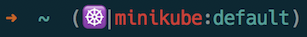
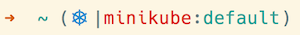
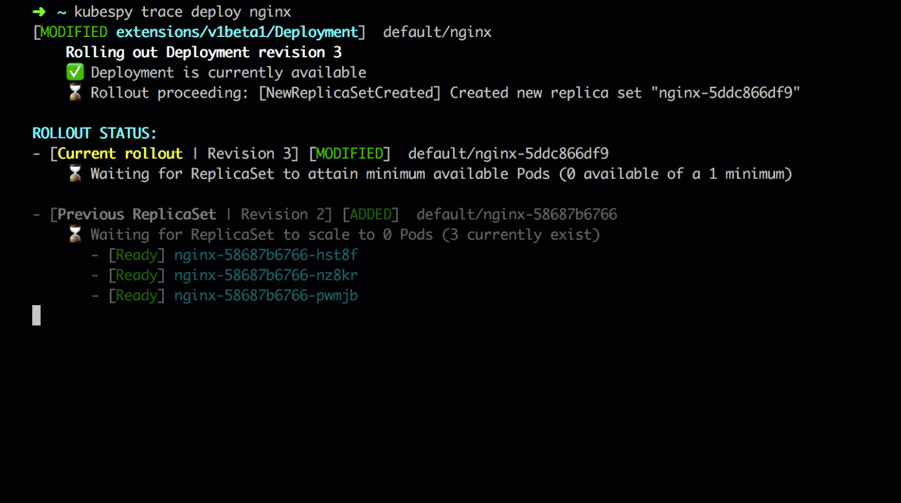

# Kubernetes Helpers

Tips and tools to make interacting with Kubernetes Clusters a bit more dandy, divine, and delicious.

- [Kubernetes Helpers](#kubernetes-helpers)
    - [Rosetta Stones (aka "Cheat Sheets")](#rosetta-stones-aka-%22cheat-sheets%22)
    - [Visual Studio Code (Extensions)](#visual-studio-code-extensions)
        - [Kubernetes (by Microsoft) (vs-kubernetes-tools)](#kubernetes-by-microsoft-vs-kubernetes-tools)
        - [YAML Support by Red Hat (yaml-language-server)](#yaml-support-by-red-hat-yaml-language-server)
        - [KubeSquash](#kubesquash)
    - [Command Line Goodies](#command-line-goodies)
        - [kube-ps1](#kube-ps1)
        - [kubectx and kubens](#kubectx-and-kubens)
        - [Kubespy](#kubespy)

## Rosetta Stones (aka "Cheat Sheets")

 > “Start where you are, use what you have, do what you can.”
 > [_Arthur Ashe_](https://en.wikipedia.org/wiki/Arthur_Ashe)

- These are from the official [kubernetes reference](https://kubernetes.io/docs/reference).  While most of this info is also found via `kubectl --help`, or various locations on the internets, these provide a nice "one stop shopping" experience.
  - [kubectl examples](https://kubernetes.io/docs/reference/kubectl/cheatsheet) (start here for "show me" examples)
  - [kubectl overview](https://kubernetes.io/docs/reference/kubectl/overview)
  - [kubectl conventions](https://kubernetes.io/docs/reference/kubectl/conventions)
  - [docker --> kubectl](https://kubernetes.io/docs/reference/kubectl/docker-cli-to-kubectl)
  - [jsonpath](https://kubernetes.io/docs/reference/kubectl/jsonpath)
- (_PR's welcome, add/share what you've found to be useful!)_

---

_Note: all images/gif's are from the projects' README's, and are included to make this faster to parse/read._

---

## Visual Studio Code (Extensions)

### Kubernetes (by Microsoft) (vs-kubernetes-tools)

The Kubernetes extension for VS Code([vs-kubernetes-tools]) is massively helpful.  The full breadth of what's possible warrents an entire series of blog posts, but TLDR it supports the following:

[vs-kubernetes-tools]: https://marketplace.visualstudio.com/items?itemName=ms-kubernetes-tools.vscode-kubernetes-tools

- load/get/show resources, fetch logs from pods, and general reduce typing `kubectl stuff`
- various helpers to create, describe, and author resources
- helpers for port forwarding (common operation...you'll end up doing this a lot)
- Interacting with [Helm](https://helm.sh), and authoring [Helm Charts](https://github.com/helm/charts)

### YAML Support by Red Hat (yaml-language-server)

Red Hat's YAML plugin ([yaml-language-server]) provides a lot of utility around editing YAML files.  Most notably, with a minor tweak you'll be Kubernetes specific autocomplete.  After installing the extension add the following setting user setting:

[yaml-language-server]: https://marketplace.visualstudio.com/items?itemName=redhat.vscode-yaml

```YAML
"yaml.schemas": {
    "Kubernetes": "*.yaml"
    }
```

After configuring this IntelliSense and Autocompletion will be a thing with Kubernetes specific context.  (Note: `^+space` will trigger autocomplete manually.  More detail can be found in the [VS Code docs](https://code.visualstudio.com/docs/editor/intellisense).


### KubeSquash

Debug your code running in kubernetes from VS Code
https://marketplace.visualstudio.com/items?itemName=ilevine.kubesquash

## Command Line Goodies

### kube-ps1

Make the bash prompt include cluster and namespace

<https://github.com/jonmosco/kube-ps1>




Install via brew.  How this looks is fully customizable and tweakable.  For details and various other installation options, the [kube-ps1 README](https://github.com/jonmosco/kube-ps1/blob/master/README.md)
is quite excellent.

``` bash
brew install kube-ps1
```

Make sure kube-ps1 is loaded from your ~/.zshrc and/or ~/.bashrc:

``` bash
source "/usr/local/opt/kube-ps1/share/kube-ps1.sh"
PS1='$(kube_ps1)'$PS1
```

Pro tip: `kubeon` and `kubeoff` enable/disable the prompt.

### kubectx and kubens

Setting the current cluster context is a frequent operation, particularly if working with multiple clusters, or switching between prod/staging/minikube/____.  `kubectx` (or it's short form `kctx`) are time and keystroke savers.  

Similarly when working with namespaces, `--namespace my-namespace-i-type-too-much` can be RSI inducing. `kubens` (or it's short form `kns`) to the rescue!

<https://github.com/ahmetb/kubectx>

**`kubectx`** helps you switch between clusters back and forth:


**`kubens`** helps you switch between Kubernetes namespaces smoothly:


```bash
brew  install kubectx --with-short-names
```

Installing using `--with-short-names` will use `kctx` instead of `kubectx`,
and `kns` instead of `kubens`.  This is nice as it won't compete with bash's autocompletion
target with `kubectl`

There are detailed directions, customization options, and a nice integration for interactive (textual) menus as well that are detailed at the [project's README](https://github.com/ahmetb/kubectx/blob/master/README.md)

### Kubespy

This is a really interesting tool that monitors / traces changes to kubernetes resources.  You can watch services being launched, or deployments being spun up/down.

_(taken from project readme)_


- <https://github.com/pulumi/kubespy>
- <https://blog.pulumi.com/kubespy-trace-a-real-time-view-into-the-heart-of-a-kubernetes-service>