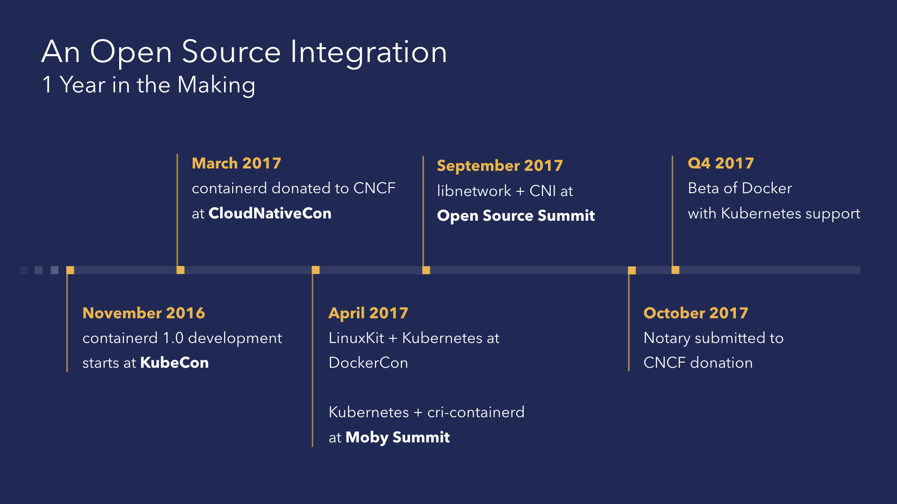
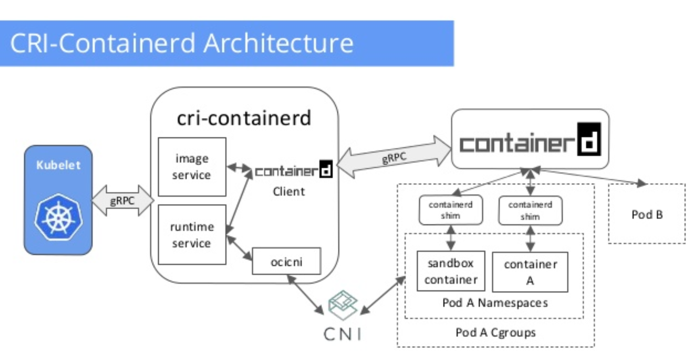
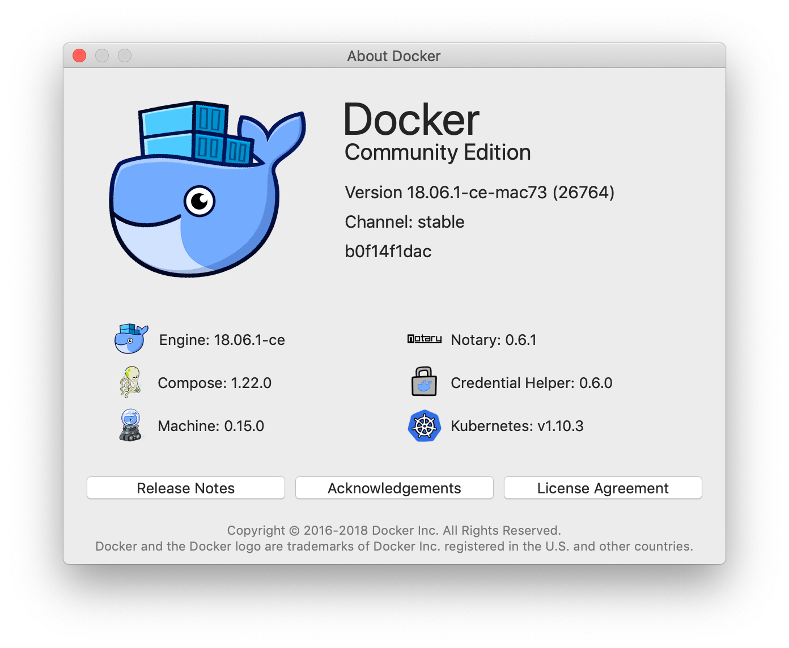
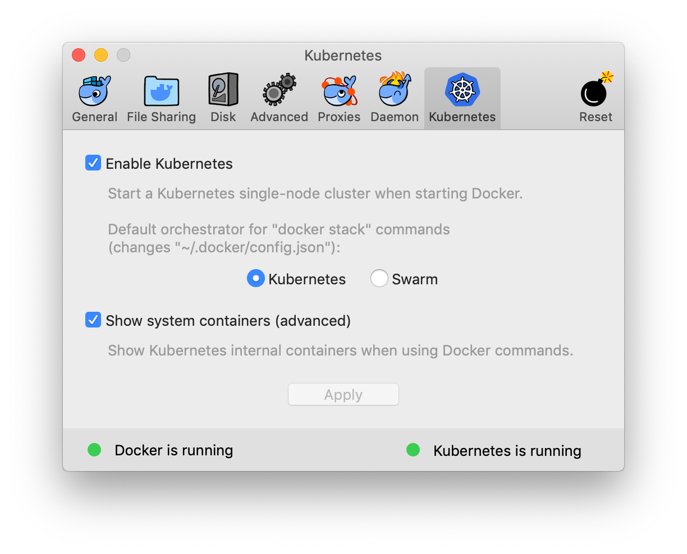
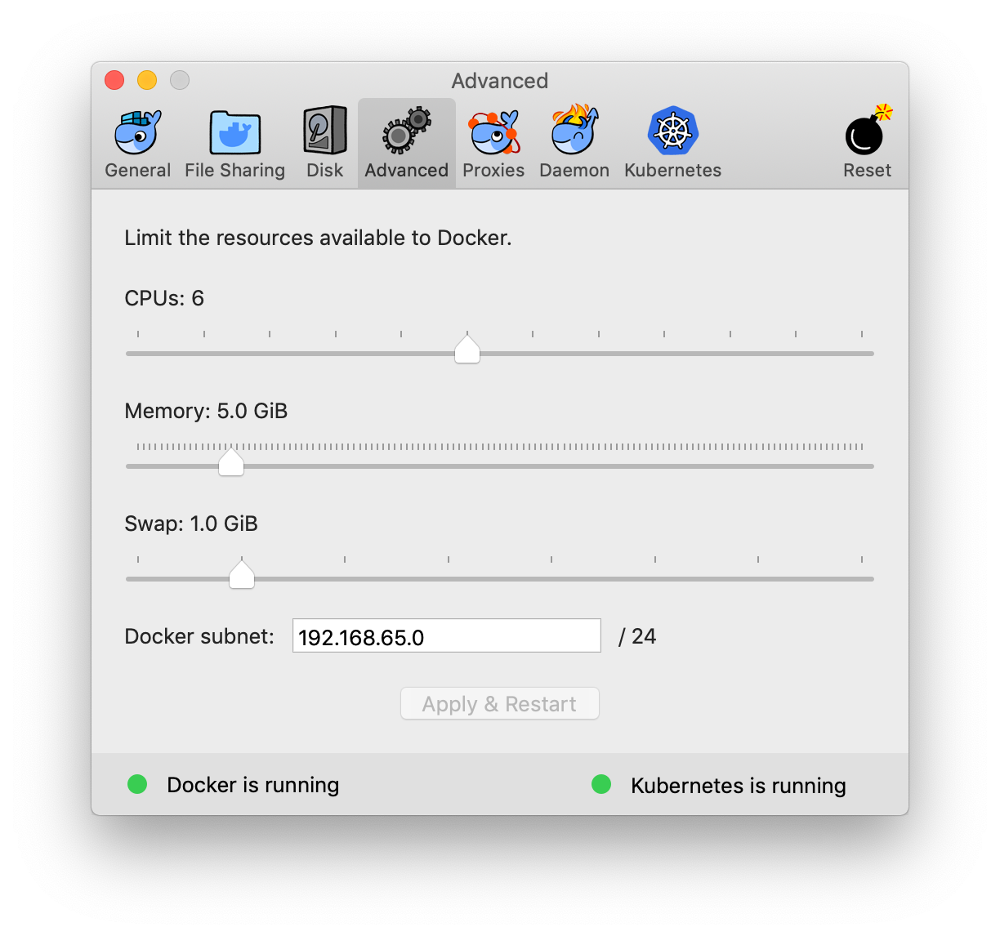
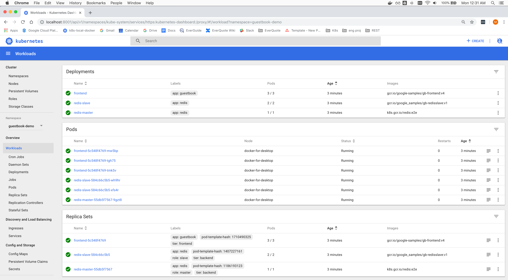
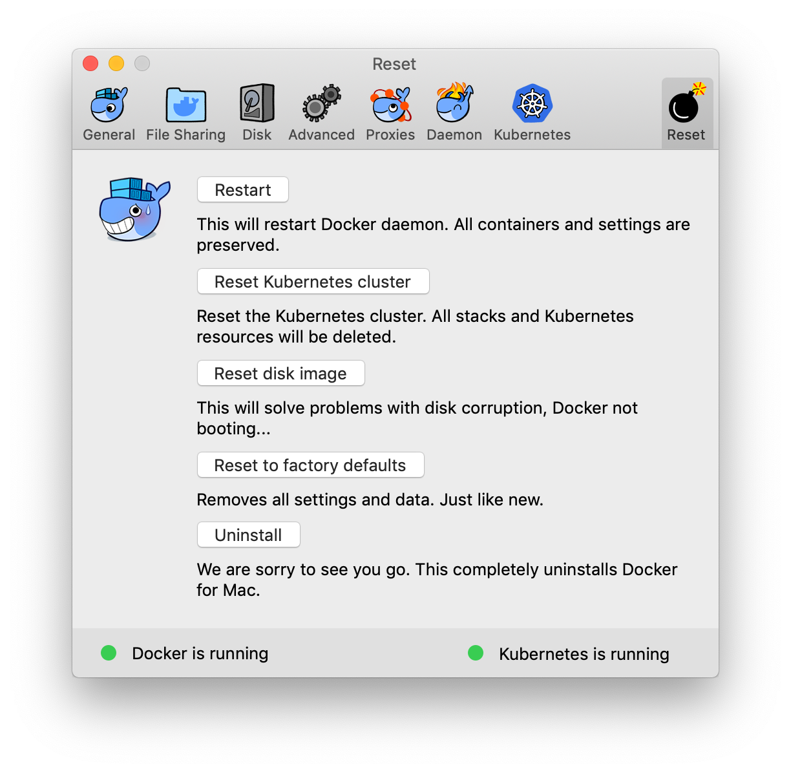

# Run a local kubernetes cluster on your MacBook

- [Run a local kubernetes cluster on your MacBook](#run-a-local-kubernetes-cluster-on-your-macbook)
  - [Who might want to do this](#who-might-want-to-do-this)
  - [But wait...Why not minikube?](#but-waitwhy-not-minikube)
  - [Run Kubernetes (itself) as...docker containers](#run-kubernetes-itself-asdocker-containers)
    - [The now (and future): K8s and containerd, CRI](#the-now-and-future-k8s-and-containerd-cri)
  - [Let's Go!](#lets-go)
    - [Install Docker CI for Mac](#install-docker-ci-for-mac)
    - [Enable Kubernetes Support](#enable-kubernetes-support)
    - [Set your context](#set-your-context)
    - [deploy the kubernetes dashboard](#deploy-the-kubernetes-dashboard)
    - [A small note on proxies](#a-small-note-on-proxies)
  - [Connect to the dashboard](#connect-to-the-dashboard)
  - [Example: Deploy the k8s.io guestbook sample](#example-deploy-the-k8sio-guestbook-sample)
    - [Create namespace: "guestbook-demo"](#create-namespace-%22guestbook-demo%22)
    - [Tip: Combat RSI: kubectl/kubens](#tip-combat-rsi-kubectlkubens)
    - [Example: Deploying PHP Guestbook application with Redis](#example-deploying-php-guestbook-application-with-redis)
    - [Example: Dashboard after deploying guestbook](#example-dashboard-after-deploying-guestbook)
    - [Example: kubectl CLI after deploying guestbook](#example-kubectl-cli-after-deploying-guestbook)
    - [Example: Clean up](#example-clean-up)
  - ["I don't like this, please make it stop"](#%22i-dont-like-this-please-make-it-stop%22)
  - [How to tail Docker for Mac logs](#how-to-tail-docker-for-mac-logs)
  
This is a quickstart guide to using kubernetes locally on your Mac.  Following it will yield a lightweight (fast) kuberenetes cluster for local development, fun and profit.  

> I highly recommend it as an alternative to [minikube]. -_halcyondude_

## Who might want to do this

- Anyone who's developing containerzed applications or microservices and deploying them to Kubernetes.
- Anyone without access (or funds) to run dev sandbox clusters in GKE / AWS / Azure / ____.
- Anyone who wants to rapidly prototype K8s configuration / yamls locally.
- Anyone (ok this is me) who likes waiting ms (vs. sec) for page refreshes --> Kubernetes Dashboard.

---

## But wait...Why not minikube?

You can!  It works as advertised and designed.

- [minikube] runs a local VM that is a one-node cluster.
- [minikube] exposes a different interface/workflow/command line than working with a production cluster.
  - `minikube this`
  - `minikube that`
  - `minikube sometimesTheSameAsK8sSometimesNot`
- It can interface with a [variety of back ends](https://github.com/kubernetes/minikube#quickstart)
- There's some degree of effort to sorting out various drivers, configuration, etc.
- There's so much to learn about minikube itself!
  - How to mount host folders (`minikube mount localPath:vmPath`)
  - How to manage [minikube add-ons](https://github.com/kubernetes/minikube/blob/master/docs/addons.md) such as coredns, ingress, heapster, dashboard, etc...
  - How to debug minikube itself!
- ...

After getting things working, your laptop will be hard at work running / maintaining minikube in a VM.  You will also now have another layer of abstraction to feed/water/understand/love (minikube itself).  

_There is another way..._

[minikube]: https://github.com/kubernetes/minikube

## Run Kubernetes (itself) as...docker containers

Docker did this. It's awesome. A full exploration of moby, containerd, cri, and the general technical approach (the reason *why* IMHO it's awesome) is beyond the scope of this quickstart.

Here's a bit of context and history, in a densly packed infoblast :)

_(taken from [mobyproject.org post](https://blog.mobyproject.org/moby-and-kubernetes-bf888ab31e38))_



- <https://blog.docker.com/2017/10/docker-for-mac-and-windows-with-kubernetes-beta>
- <https://blog.docker.com/2017/10/kubernetes-docker-platform-and-moby-project>
- <https://blog.docker.com/2018/01/docker-mac-kubernetes>
- <https://blog.mobyproject.org/moby-and-kubernetes-bf888ab31e38>
- <https://blog.docker.com/2018/07/kubernetes-is-now-available-in-docker-desktop-stable-channel>

### The now (and future): K8s and containerd, CRI

_(taken from [Liu Lantao's talk](https://www.slideshare.net/Docker/kubernetes-cri-containerd-integration-by-lantao-liu-google))_



- <https://mobyproject.org/kubernetes>
- <https://www.slideshare.net/Docker/kubernetes-cri-containerd-integration-by-lantao-liu-google>
- <https://github.com/containerd/containerd>
- <https://github.com/containerd/cri>

---

## Let's Go!

### Install Docker CI for Mac

This guide assumes you're running Docker Community Edition (CE) for Mac.  If you haven't already, [install Docker CE for Mac].

[install Docker CE for Mac]: https://docs.docker.com/docker-for-mac/install

This quickstart was written in Nov 2018, using Docker CE 18.06.1-ce-mac73(26764).



### Enable Kubernetes Support

I prefer to allow the containers to not be hidden from normal docker commands.  YMMV.



Depending on your use case(s) you might want to increase memory/disk or setup additional storage.  The defaults work quite well.



### Set your context

```bash
kubectl config use-context docker-for-desktop
```

At this point, you can issue normal commands such as:

- `kubectl create -f my-special-something.yaml`
- `kubectl get pods`
- `kubectl apply -f party-on-wayne.yaml`

### deploy the kubernetes dashboard

The official [dashboard wiki] is the source of truth.  

[dashboard wiki]: https://github.com/kubernetes/dashboard/wiki

Deploy directly from github master...

```bash
kubectl create -f https://raw.githubusercontent.com/kubernetes/dashboard/master/src/deploy/recommended/kubernetes-dashboard.yaml
```

or

```bash
git clone git@github.com:kubernetes/dashboard.git && cd dashboard
kubectl create -f src/deploy/recommended/kubernetes-dashboard.yaml
```

Example:

```shell
$ kubectl create -f https://raw.githubusercontent.com/kubernetes/dashboard/master/src/deploy/recommended/kubernetes-dashboard.yaml
secret/kubernetes-dashboard-certs created
serviceaccount/kubernetes-dashboard created
role.rbac.authorization.k8s.io/kubernetes-dashboard-minimal created
rolebinding.rbac.authorization.k8s.io/kubernetes-dashboard-minimal created
deployment.apps/kubernetes-dashboard created
service/kubernetes-dashboard created
```

### A small note on proxies

There are various proxies at play.  [Proxies in Kubernetes] is a good starting point for more info.

[Proxies in Kubernetes]: https://kubernetes.io/docs/concepts/cluster-administration/proxies

We're going to use `kubectl proxy` to create a local port, thru which we can access the dashboard running a service in our newly formed cluster.  Of course this can all be customized...

> ```kubectl proxy -h```
> 
> Creates a proxy server or application-level gateway between localhost and the Kubernetes API Server. It also allows
> serving static content over specified HTTP path. All incoming data enters through one port and gets forwarded to the
> remote kubernetes API Server port, except for the path matching the static content path.
>
> _(...)_

A nice overview of different ways to access a cluster is here:

<https://kubernetes.io/docs/tasks/access-application-cluster/access-cluster/#directly-accessing-the-rest-api>

## Connect to the dashboard

```bash
# start the proxy so we can access the cluster
kubectl proxy

# launch the default browser
open http://localhost:8001/api/v1/namespaces/kube-system/services/https:kubernetes-dashboard:/proxy

# at the login screen, click "SKIP"
```

Configuring more advanced auth than "SKIP", or accessing your local cluster (or services in it) without
using `kubectl proxy` is certainly possible, and outside the scope of this quickstart.  You can create
an ingress controller, set up certs / TLS, etc.  See the documentation for the dashboard project for more details.

## Example: Deploy the k8s.io guestbook sample

### Create namespace: "guestbook-demo"

We'll first create a namespace in our cluster for experimentation:

```bash
kubectl create namespace guestbook-demo
kubectl config set-context $(kubectl config current-context) --namespace=guestbook-demo
```

### Tip: Combat RSI: kubectl/kubens

It's tedious and painful to constantly be typing things like this:

 `kubectl config set-context $(what? ugh fine) --namespace=OmgImStillTyping`

kubectx and kubens to the rescue!

```bash
# https://github.com/ahmetb/kubectx - restore sanity
$ kubens --help
USAGE:
  kubens                    : list the namespaces in the current context
  kubens <NAME>             : change the active namespace of current context
  kubens -                  : switch to the previous namespace in this context
  kubens -h,--help          : show this message

$ kubens guestbook-demo
Context "docker-for-desktop" modified.
Active namespace is "guestbook-demo".
```

### Example: Deploying PHP Guestbook application with Redis

The "abridged" version of the [guestbook demo]:

[guestbook demo]: https://kubernetes.io/docs/tutorials/stateless-application/guestbook

```bash
kubectl apply -f https://k8s.io/examples/application/guestbook/redis-master-deployment.yaml
kubectl apply -f https://k8s.io/examples/application/guestbook/redis-master-service.yaml
kubectl apply -f https://k8s.io/examples/application/guestbook/redis-slave-deployment.yaml
kubectl apply -f https://k8s.io/examples/application/guestbook/redis-slave-service.yaml
kubectl apply -f https://k8s.io/examples/application/guestbook/frontend-deployment.yaml
kubectl apply -f https://k8s.io/examples/application/guestbook/frontend-service.yaml
```

The following will be created:

```text
deployment.apps/redis-master created
service/redis-master created
deployment.apps/redis-slave created
service/redis-slave created
deployment.apps/frontend created
service/frontend created
```

### Example: Dashboard after deploying guestbook

The view from the Dashboard (should) look like this:



### Example: kubectl CLI after deploying guestbook

```bash
# At this point, the full demo is up.  One could use the dashboard, or the CLI

$ kubectl get pods
NAME                            READY   STATUS    RESTARTS   AGE
frontend-5c548f4769-mw5bp       1/1     Running   0          21m
frontend-5c548f4769-tgh75       1/1     Running   0          21m
frontend-5c548f4769-tmk5v       1/1     Running   0          21m
redis-master-55db5f7567-9gzt8   1/1     Running   0          22m
redis-slave-584c66c5b5-wh9hr    1/1     Running   0          21m
redis-slave-584c66c5b5-xfs4r    1/1     Running   0          21m

$ kubectl get services
NAME           TYPE        CLUSTER-IP       EXTERNAL-IP   PORT(S)        AGE
frontend       NodePort    10.103.203.196   <none>        80:31062/TCP   21m
redis-master   ClusterIP   10.101.104.224   <none>        6379/TCP       22m
redis-slave    ClusterIP   10.96.60.87      <none>        6379/TCP       22m

$ kubectl get replicasets
NAME                      DESIRED   CURRENT   READY   AGE
frontend-5c548f4769       3         3         3       22m
redis-master-55db5f7567   1         1         1       22m
redis-slave-584c66c5b5    2         2         2       22m
```

There's a great explanation on how to access services in the kubernetes docs here: [apiserver-proxy-urls].

To manually construct a proxy URL, follow this form:

```http://kubernetes_master_address/api/v1/namespaces/namespace_name/services/[https:]service_name[:port_name]/proxy```

```bash

# In our case, to access the guestbook via web browser:
open http://localhost:8001/api/v1/namespaces/guestbook-demo/services/frontend/proxy

```

[apiserver-proxy-urls]: https://kubernetes.io/docs/tasks/administer-cluster/access-cluster-services/#manually-constructing-apiserver-proxy-urls

### Example: Clean up

```bash

kubectl delete deployment -l app=redis
kubectl delete service -l app=redis
kubectl delete deployment -l app=guestbook
kubectl delete service -l app=guestbook

```

## "I don't like this, please make it stop"




## How to tail Docker for Mac logs

<https://docs.docker.com/docker-for-mac/troubleshoot/#check-the-logs>

```bash

pred='process matches ".*(ocker|vpnkit).*"
  || (process in {"taskgated-helper", "launchservicesd", "kernel"} && eventMessage contains[c] "docker")'
/usr/bin/log stream --style syslog --level=debug --color=always --predicate "$pred"

```


