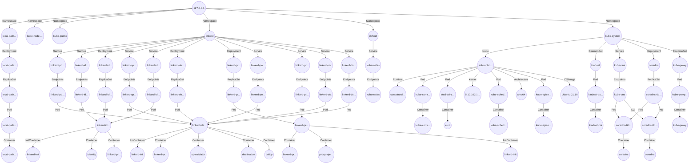

# mermaid test

```mermaid
graph
  232a8350-698a-2bb4-9761-1e82063ef7a3((Ubuntu 21.10)):::OSImage
  48a480b9-1e67-7f7a-54ca-0068aaf93406((kindnet-cni)):::Container
  af867bb8-9f05-5ed7-a17a-23e24fbd86cc((linkerd-init)):::Container
  8975dd4e-8ace-a74a-e204-9ed402d1bed6((local-path...)):::Container
  0ba6572c-e780-429c-84f7-8a76aeaf5997((linkerd-pr...)):::Deployment
  ba95df61-d09c-4de7-a4c5-7e64df4632b6((etcd-sol-c...)):::Pod
  4d1e546c-7119-d3d3-5821-38829a0f42f4((sp-validator)):::Container
  04838a8d-2da8-4c51-836c-337579d90e24((coredns-6d...)):::Pod
  4d883893-4c1f-4bb0-adb1-520a23e197d9((linkerd-id...)):::Pod
  68875d87-e11c-4c94-a2ef-58e74b6f7bd4((linkerd-id...)):::Endpoints
  8de47ada-b0e3-0076-e179-bcb90359e40e((kube-system)):::Namespace
  a177c187-a370-b54c-75d7-f2e35d58ed62((amd64)):::Architecture
  da7f7426-1910-4130-99e1-213aa91a8200((kindnet-qx...)):::Pod
  4d5d0348-0071-6269-d417-257a938efdd2((policy)):::Container
  e2d1943e-269a-c9df-749b-2340a98636e2((proxy-inje...)):::Container
  e4c6e7aa-e786-4b27-a61d-7383b7c6bc77((linkerd-pr...)):::Pod
  ebb5b436-e3b9-42db-5641-569c7e68800d((127.0.0.1)):::Cluster
  cbb522bb-b47e-6bc0-dcfe-b57e2b8ca8b0((kube-public)):::Namespace
  c7b40e17-134e-43a9-97f0-b5b02e4ad0a7((sol-contro...)):::Node
  40479113-b0ce-4060-b1f8-bd1848c4ec8d((kube-apise...)):::Pod
  27e427de-c2d5-40f9-8487-906f72c0b314((local-path...)):::ReplicaSet
  008fb67f-144b-4889-9e43-2e3f58806826((linkerd-pr...)):::Service
  b7c650e3-cc94-147f-f7a3-ca1e98763c8c((coredns)):::Container
  46dbabb2-cb77-a77d-5072-641954132d9a((kube-apise...)):::Container
  b10a4c5a-bdb8-cd28-0831-ae4be5c2cbf4((linkerd-pr...)):::Container
  859b16d4-47dc-486b-826d-bcba395b904f((local-path...)):::Pod
  d98998cd-323d-43e6-9421-2a46245daca5((linkerd-id...)):::Service
  deace941-28c4-4b24-a5b3-523bfbddce6a((linkerd-dst)):::Endpoints
  2d5d7201-76b0-4010-9978-2bac3d8c2a67((linkerd-de...)):::Pod
  8930784b-fe36-4cb1-8c95-56f0c4fcaf8c((linkerd-ds...)):::Endpoints
  8ea9f8b2-35b0-4c3b-86dd-899cfcbd7a9d((linkerd-po...)):::Endpoints
  c589f176-d68f-41c7-b1b8-8fae482af2e3((kube-proxy)):::DaemonSet
  ee42be9f-b366-4110-8390-68dedc575639((linkerd-pr...)):::ReplicaSet
  5bda3344-6a2e-4c57-8001-a6c609c4e9d1((coredns)):::Deployment
  bb2ebbd2-92e5-4dfa-bb07-cbacf88b32f0((linkerd-id...)):::Deployment
  82479d1e-b258-0168-12ba-2d26a182b265((5.10.102.1...)):::Kernel
  7dc7c3d3-d759-41e2-55a4-0c881b6a9646((identity)):::Container
  caa8bbc1-9b1a-4bf7-9b16-9d83170d8268((linkerd-dst)):::Service
  bd88bc38-5e7d-492c-8075-9265c2a65322((linkerd-ds...)):::Service
  f4c239fa-4175-6de7-f20b-65484c51f36c((kube-node-...)):::Namespace
  9f838c78-d092-d9db-64cc-a69f0084dd5f((linkerd)):::Namespace
  6e2ae06f-657a-ba90-f6e8-bd629a9455f1((containerd...)):::Runtime
  a296c02b-bcf6-51a8-dcf8-e92e2ab69e54((etcd)):::Container
  5a3aa5a6-fd0e-41f0-a049-ca1c5ad0b838((kube-sched...)):::Pod
  4ad52ef4-87b8-921a-5ecb-9051d0ca1e92((linkerd-init)):::Container
  1bec2f72-cdca-4162-8676-f9bfd950693f((kubernetes)):::Service
  22ea7e7e-02ad-4a77-b686-d99363c250b7((kube-proxy...)):::Pod
  2d87eaa9-81ac-bd54-ccd3-4b392d2edcc5((destination)):::Container
  3d0c338d-ac7e-e76e-25e4-0c0cb014cd65((linkerd-init)):::Container
  18b61824-f080-4e8d-8a2b-e4f61ede4f7d((linkerd-po...)):::Service
  27fef1ee-6d61-9e0d-3c66-a80a16f0875e((local-path...)):::Namespace
  30eec557-fdba-7b9b-b589-e719bd0fccb6((kube-contr...)):::Container
  30135d27-f419-6c66-1791-e583e11a6fce((kube-sched...)):::Container
  44a35c5c-28b6-4ddc-9f12-5129ef17849d((kube-dns)):::Endpoints
  8bf21d73-09c5-4600-bb43-bfe5294890c0((linkerd-sp...)):::Endpoints
  a39fe298-00df-457c-b723-ea1b77c9ee42((linkerd-de...)):::ReplicaSet
  8c6c4629-1cc5-48d4-bc8c-3316a2155d6d((linkerd-id...)):::ReplicaSet
  17ba3f97-71a4-4096-832f-71e9307fc598((linkerd-pr...)):::Endpoints
  9c5fe10a-2df3-c331-5d08-6157f20acf75((kube-proxy)):::Container
  f231015a-da61-8a43-7003-a5b3779be5fc((linkerd-pr...)):::Container
  ff766278-e63c-4880-adfa-d3005f768dc4((kube-dns)):::Service
  bbfed753-965a-e9c1-0e52-86e8c0509a39((coredns)):::Container
  9a347e46-32ea-436c-bb39-e961f35dbd8d((kindnet)):::DaemonSet
  ea1d0d93-016c-4ae5-34df-524097487cb7((linkerd-pr...)):::Container
  650b6be3-7a54-41be-9a3e-4407d4a02c57((linkerd-id...)):::Service
  e678b2cc-1207-479f-9ae6-6c59594b46be((coredns-6d...)):::Pod
  720983bc-d94e-ffc4-ab67-06bfe2745371((default)):::Namespace
  807c2485-6a6d-42c2-9ae2-a4be00d4f4d5((coredns-6d...)):::ReplicaSet
  d53737dc-48d5-44ab-b0ec-218b4b97f5a7((linkerd-de...)):::Deployment
  210b914c-296c-4229-ac13-0e4ef411bf33((kubernetes)):::Endpoints
  ad1f170d-00ae-49be-bcfc-021e1523b5f2((linkerd-id...)):::Endpoints
  cf923649-7d98-486d-82fa-bd5b8f881a61((linkerd-po...)):::Endpoints
  4665b9b4-3a91-4587-b847-7f0b907dea90((kube-contr...)):::Pod
  7683a1e4-7ca2-485b-80c4-c2da8a6e92d4((linkerd-po...)):::Service
  adf5eed5-cd26-48b7-9992-5fc9eec1db05((linkerd-sp...)):::Service
  cb94ab0a-17a5-42b7-a09f-14f38c9ddd54((local-path...)):::Deployment
  9f838c78-d092-d9db-64cc-a69f0084dd5f -- Service --> 18b61824-f080-4e8d-8a2b-e4f61ede4f7d
  9f838c78-d092-d9db-64cc-a69f0084dd5f -- Service --> 650b6be3-7a54-41be-9a3e-4407d4a02c57
  ebb5b436-e3b9-42db-5641-569c7e68800d -- Namespace --> 27fef1ee-6d61-9e0d-3c66-a80a16f0875e
  008fb67f-144b-4889-9e43-2e3f58806826 -- Endpoints --> 17ba3f97-71a4-4096-832f-71e9307fc598
  44a35c5c-28b6-4ddc-9f12-5129ef17849d -- Pod --> 04838a8d-2da8-4c51-836c-337579d90e24
  807c2485-6a6d-42c2-9ae2-a4be00d4f4d5 -- Pod --> 04838a8d-2da8-4c51-836c-337579d90e24
  2d5d7201-76b0-4010-9978-2bac3d8c2a67 -- InitContainer --> af867bb8-9f05-5ed7-a17a-23e24fbd86cc
  e4c6e7aa-e786-4b27-a61d-7383b7c6bc77 -- Container --> ea1d0d93-016c-4ae5-34df-524097487cb7
  5bda3344-6a2e-4c57-8001-a6c609c4e9d1 -- ReplicaSet --> 807c2485-6a6d-42c2-9ae2-a4be00d4f4d5
  8de47ada-b0e3-0076-e179-bcb90359e40e -- Node --> c7b40e17-134e-43a9-97f0-b5b02e4ad0a7
  9f838c78-d092-d9db-64cc-a69f0084dd5f -- Deployment --> bb2ebbd2-92e5-4dfa-bb07-cbacf88b32f0
  8de47ada-b0e3-0076-e179-bcb90359e40e -- DaemonSet --> 9a347e46-32ea-436c-bb39-e961f35dbd8d
  c7b40e17-134e-43a9-97f0-b5b02e4ad0a7 -- Runtime --> 6e2ae06f-657a-ba90-f6e8-bd629a9455f1
  c7b40e17-134e-43a9-97f0-b5b02e4ad0a7 -- Pod --> 4665b9b4-3a91-4587-b847-7f0b907dea90
  1bec2f72-cdca-4162-8676-f9bfd950693f -- Endpoints --> 210b914c-296c-4229-ac13-0e4ef411bf33
  18b61824-f080-4e8d-8a2b-e4f61ede4f7d -- Endpoints --> 8ea9f8b2-35b0-4c3b-86dd-899cfcbd7a9d
  8de47ada-b0e3-0076-e179-bcb90359e40e -- Service --> ff766278-e63c-4880-adfa-d3005f768dc4
  9f838c78-d092-d9db-64cc-a69f0084dd5f -- Service --> adf5eed5-cd26-48b7-9992-5fc9eec1db05
  44a35c5c-28b6-4ddc-9f12-5129ef17849d -- Pod --> e678b2cc-1207-479f-9ae6-6c59594b46be
  807c2485-6a6d-42c2-9ae2-a4be00d4f4d5 -- Pod --> e678b2cc-1207-479f-9ae6-6c59594b46be
  ebb5b436-e3b9-42db-5641-569c7e68800d -- Namespace --> f4c239fa-4175-6de7-f20b-65484c51f36c
  4d883893-4c1f-4bb0-adb1-520a23e197d9 -- InitContainer --> 4ad52ef4-87b8-921a-5ecb-9051d0ca1e92
  d98998cd-323d-43e6-9421-2a46245daca5 -- Endpoints --> ad1f170d-00ae-49be-bcfc-021e1523b5f2
  0ba6572c-e780-429c-84f7-8a76aeaf5997 -- ReplicaSet --> ee42be9f-b366-4110-8390-68dedc575639
  cb94ab0a-17a5-42b7-a09f-14f38c9ddd54 -- ReplicaSet --> 27e427de-c2d5-40f9-8487-906f72c0b314
  ebb5b436-e3b9-42db-5641-569c7e68800d -- Namespace --> cbb522bb-b47e-6bc0-dcfe-b57e2b8ca8b0
  2d5d7201-76b0-4010-9978-2bac3d8c2a67 -- Container --> f231015a-da61-8a43-7003-a5b3779be5fc
  e4c6e7aa-e786-4b27-a61d-7383b7c6bc77 -- Container --> e2d1943e-269a-c9df-749b-2340a98636e2
  c7b40e17-134e-43a9-97f0-b5b02e4ad0a7 -- Pod --> ba95df61-d09c-4de7-a4c5-7e64df4632b6
  da7f7426-1910-4130-99e1-213aa91a8200 -- Container --> 48a480b9-1e67-7f7a-54ca-0068aaf93406
  2d5d7201-76b0-4010-9978-2bac3d8c2a67 -- Container --> 4d1e546c-7119-d3d3-5821-38829a0f42f4
  650b6be3-7a54-41be-9a3e-4407d4a02c57 -- Endpoints --> 68875d87-e11c-4c94-a2ef-58e74b6f7bd4
  7683a1e4-7ca2-485b-80c4-c2da8a6e92d4 -- Endpoints --> cf923649-7d98-486d-82fa-bd5b8f881a61
  8de47ada-b0e3-0076-e179-bcb90359e40e -- Deployment --> 5bda3344-6a2e-4c57-8001-a6c609c4e9d1
  27fef1ee-6d61-9e0d-3c66-a80a16f0875e -- Deployment --> cb94ab0a-17a5-42b7-a09f-14f38c9ddd54
  c7b40e17-134e-43a9-97f0-b5b02e4ad0a7 -- Kernel --> 82479d1e-b258-0168-12ba-2d26a182b265
  c7b40e17-134e-43a9-97f0-b5b02e4ad0a7 -- Pod --> 5a3aa5a6-fd0e-41f0-a049-ca1c5ad0b838
  2d5d7201-76b0-4010-9978-2bac3d8c2a67 -- Container --> 2d87eaa9-81ac-bd54-ccd3-4b392d2edcc5
  9f838c78-d092-d9db-64cc-a69f0084dd5f -- Service --> d98998cd-323d-43e6-9421-2a46245daca5
  ebb5b436-e3b9-42db-5641-569c7e68800d -- Namespace --> 9f838c78-d092-d9db-64cc-a69f0084dd5f
  22ea7e7e-02ad-4a77-b686-d99363c250b7 -- Container --> 9c5fe10a-2df3-c331-5d08-6157f20acf75
  9f838c78-d092-d9db-64cc-a69f0084dd5f -- Deployment --> d53737dc-48d5-44ab-b0ec-218b4b97f5a7
  9f838c78-d092-d9db-64cc-a69f0084dd5f -- Deployment --> 0ba6572c-e780-429c-84f7-8a76aeaf5997
  2d5d7201-76b0-4010-9978-2bac3d8c2a67 -- Container --> 4d5d0348-0071-6269-d417-257a938efdd2
  ff766278-e63c-4880-adfa-d3005f768dc4 -- Endpoints --> 44a35c5c-28b6-4ddc-9f12-5129ef17849d
  bd88bc38-5e7d-492c-8075-9265c2a65322 -- Endpoints --> 8930784b-fe36-4cb1-8c95-56f0c4fcaf8c
  d53737dc-48d5-44ab-b0ec-218b4b97f5a7 -- ReplicaSet --> a39fe298-00df-457c-b723-ea1b77c9ee42
  40479113-b0ce-4060-b1f8-bd1848c4ec8d -- Container --> 46dbabb2-cb77-a77d-5072-641954132d9a
  c589f176-d68f-41c7-b1b8-8fae482af2e3 -- Pod --> 22ea7e7e-02ad-4a77-b686-d99363c250b7
  8de47ada-b0e3-0076-e179-bcb90359e40e -- DaemonSet --> c589f176-d68f-41c7-b1b8-8fae482af2e3
  720983bc-d94e-ffc4-ab67-06bfe2745371 -- Service --> 1bec2f72-cdca-4162-8676-f9bfd950693f
  9f838c78-d092-d9db-64cc-a69f0084dd5f -- Service --> 7683a1e4-7ca2-485b-80c4-c2da8a6e92d4
  ad1f170d-00ae-49be-bcfc-021e1523b5f2 -- Pod --> 4d883893-4c1f-4bb0-adb1-520a23e197d9
  68875d87-e11c-4c94-a2ef-58e74b6f7bd4 -- Pod --> 4d883893-4c1f-4bb0-adb1-520a23e197d9
  8c6c4629-1cc5-48d4-bc8c-3316a2155d6d -- Pod --> 4d883893-4c1f-4bb0-adb1-520a23e197d9
  c7b40e17-134e-43a9-97f0-b5b02e4ad0a7 -- Architecture --> a177c187-a370-b54c-75d7-f2e35d58ed62
  e678b2cc-1207-479f-9ae6-6c59594b46be -- Container --> b7c650e3-cc94-147f-f7a3-ca1e98763c8c
  9f838c78-d092-d9db-64cc-a69f0084dd5f -- Service --> 008fb67f-144b-4889-9e43-2e3f58806826
  4d883893-4c1f-4bb0-adb1-520a23e197d9 -- Container --> 7dc7c3d3-d759-41e2-55a4-0c881b6a9646
  adf5eed5-cd26-48b7-9992-5fc9eec1db05 -- Endpoints --> 8bf21d73-09c5-4600-bb43-bfe5294890c0
  ebb5b436-e3b9-42db-5641-569c7e68800d -- Namespace --> 720983bc-d94e-ffc4-ab67-06bfe2745371
  ba95df61-d09c-4de7-a4c5-7e64df4632b6 -- Container --> a296c02b-bcf6-51a8-dcf8-e92e2ab69e54
  9f838c78-d092-d9db-64cc-a69f0084dd5f -- Service --> caa8bbc1-9b1a-4bf7-9b16-9d83170d8268
  9f838c78-d092-d9db-64cc-a69f0084dd5f -- Service --> bd88bc38-5e7d-492c-8075-9265c2a65322
  deace941-28c4-4b24-a5b3-523bfbddce6a -- Pod --> 2d5d7201-76b0-4010-9978-2bac3d8c2a67
  8930784b-fe36-4cb1-8c95-56f0c4fcaf8c -- Pod --> 2d5d7201-76b0-4010-9978-2bac3d8c2a67
  cf923649-7d98-486d-82fa-bd5b8f881a61 -- Pod --> 2d5d7201-76b0-4010-9978-2bac3d8c2a67
  8ea9f8b2-35b0-4c3b-86dd-899cfcbd7a9d -- Pod --> 2d5d7201-76b0-4010-9978-2bac3d8c2a67
  8bf21d73-09c5-4600-bb43-bfe5294890c0 -- Pod --> 2d5d7201-76b0-4010-9978-2bac3d8c2a67
  a39fe298-00df-457c-b723-ea1b77c9ee42 -- Pod --> 2d5d7201-76b0-4010-9978-2bac3d8c2a67
  17ba3f97-71a4-4096-832f-71e9307fc598 -- Pod --> e4c6e7aa-e786-4b27-a61d-7383b7c6bc77
  ee42be9f-b366-4110-8390-68dedc575639 -- Pod --> e4c6e7aa-e786-4b27-a61d-7383b7c6bc77
  c7b40e17-134e-43a9-97f0-b5b02e4ad0a7 -- Pod --> 40479113-b0ce-4060-b1f8-bd1848c4ec8d
  5a3aa5a6-fd0e-41f0-a049-ca1c5ad0b838 -- Container --> 30135d27-f419-6c66-1791-e583e11a6fce
  e4c6e7aa-e786-4b27-a61d-7383b7c6bc77 -- InitContainer --> 3d0c338d-ac7e-e76e-25e4-0c0cb014cd65
  859b16d4-47dc-486b-826d-bcba395b904f -- Container --> 8975dd4e-8ace-a74a-e204-9ed402d1bed6
  caa8bbc1-9b1a-4bf7-9b16-9d83170d8268 -- Endpoints --> deace941-28c4-4b24-a5b3-523bfbddce6a
  ebb5b436-e3b9-42db-5641-569c7e68800d -- Namespace --> 8de47ada-b0e3-0076-e179-bcb90359e40e
  9a347e46-32ea-436c-bb39-e961f35dbd8d -- Pod --> da7f7426-1910-4130-99e1-213aa91a8200
  4665b9b4-3a91-4587-b847-7f0b907dea90 -- Container --> 30eec557-fdba-7b9b-b589-e719bd0fccb6
  4d883893-4c1f-4bb0-adb1-520a23e197d9 -- Container --> b10a4c5a-bdb8-cd28-0831-ae4be5c2cbf4
  27e427de-c2d5-40f9-8487-906f72c0b314 -- Pod --> 859b16d4-47dc-486b-826d-bcba395b904f
  bb2ebbd2-92e5-4dfa-bb07-cbacf88b32f0 -- ReplicaSet --> 8c6c4629-1cc5-48d4-bc8c-3316a2155d6d
  c7b40e17-134e-43a9-97f0-b5b02e4ad0a7 -- OSImage --> 232a8350-698a-2bb4-9761-1e82063ef7a3
  04838a8d-2da8-4c51-836c-337579d90e24 -- Container --> bbfed753-965a-e9c1-0e52-86e8c0509a39
```