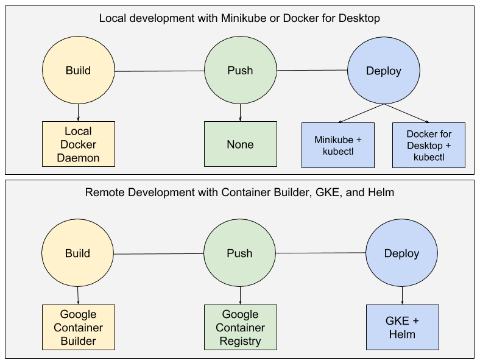

# Skaffold Notes

- [Skaffold Notes](#skaffold-notes)
    - [What is this?](#what-is-this)
    - [Excessivly Abridged and Paraphrased Docs](#excessivly-abridged-and-paraphrased-docs)
    - [Relevant Links](#relevant-links)
    - [Skaffold GKE quickstart](#skaffold-gke-quickstart)
        - [set up docker container access](#set-up-docker-container-access)
        - [Get Cluster Creds](#get-cluster-creds)
        - [get skaffold sources](#get-skaffold-sources)
        - [Install (osx)](#install-osx)
        - [Run GKE quickstart](#run-gke-quickstart)
    - [Skaffold Local Cluster (docker)](#skaffold-local-cluster-docker)

## What is this?

- CLI tool for iterative dev of apps destined for k8s
- iterate locally, automated build+push+deploy
- stream container logs (e.g. `tail -f $myContainerInCluster`)
- works in CI/CD
- works in { GKE, docker for mac, minikube }


> _image from https://github.com/GoogleContainerTools/skaffold/blob/master/docs/img/plugability.png_

## Excessivly Abridged and Paraphrased Docs

There are 2 basic [operating modes](https://github.com/GoogleContainerTools/skaffold#operating-modes)

```bash
# the core duty-cycle
doBasic() { build(); push(); deploy(); }
```

1. `skaffold run` : `doBasic();`
2. `skaffold dev` : `doBasic(); streamLogs();` <-- (if src files change rinse/repeat)

```console
$ skaffold help
A tool that facilitates continuous development for Kubernetes applications.

Usage:
  skaffold [command]

Available Commands:
  build       Builds the artifacts
  completion  Output command completion script for the bash shell
  config      A set of commands for interacting with the skaffold config.
  delete      Delete the deployed resources
  deploy      Deploys the artifacts
  dev         Runs a pipeline file in development mode
  diagnose    Run a diagnostic on Skaffold
  fix         Converts old skaffold.yaml to newest schema version
  help        Help about any command
  init        Automatically generate skaffold configuration for deploying an application
  run         Runs a pipeline file
  version     Print the version information

Flags:
  -h, --help               help for skaffold
  -v, --verbosity string   Log level (debug, info, warn, error, fatal, panic) (default "warning")

Use "skaffold [command] --help" for more information about a command.
```

## Relevant Links

|                  |                                                                                                              |
| ---------------- | ------------------------------------------------------------------------------------------------------------ |
| Project          | <https://github.com/GoogleContainerTools/skaffold>                                                           |
| Video            | <https://github.com/GoogleContainerTools/skaffold/blob/master/docs/img/intro.gif>                            |
| Examples         | <https://github.com/GoogleContainerTools/skaffold/tree/master/examples>                                      |
| Google Marketing | <https://cloud.google.com/blog/products/gcp/introducing-skaffold-easy-and-repeatable-kubernetes-development> |
| Brief Blog       | <https://ahmet.im/blog/skaffold>                                                                             |
| Squash: TODO     | <https://github.com/solo-io/kubesquash>                                                                      |

## Skaffold GKE quickstart

### set up docker container access

<https://cloud.google.com/container-registry/docs/advanced-authentication>

```bash
gcloud components install docker-credential-gcr
docker-credential-gcr configure-docker
/Users/myoung/.docker/config.json configured to use this credential helper for GCR registries
```

~/.docker/config.json

```json
{
  "auths": {
    "gcr.io": {},
    "https://index.docker.io/v1/": {}
  },
  "credHelpers": {
    "gcr.io": "gcloud",
    "us.gcr.io": "gcloud",
    "eu.gcr.io": "gcloud",
    "asia.gcr.io": "gcloud",
    "staging-k8s.gcr.io": "gcloud",
    "marketplace.gcr.io": "gcloud"
  },
  "credsStore": "osxkeychain",
  "HttpHeaders": {
    "User-Agent": "Docker-Client/18.06.1-ce (darwin)"
  }
}
```

### Get Cluster Creds

```bash
gcloud container clusters get-credentials valhalla --zone us-east1-b --project myoung-dev
```

### get skaffold sources

```bash
git clone https://github.com/GoogleContainerTools/skaffold.git
cd skaffold/examples/getting-started
```

### Install (osx)

<https://github.com/GoogleContainerTools/skaffold#installation>

```bash
curl -Lo skaffold https://storage.googleapis.com/skaffold/releases/latest/skaffold-darwin-amd64
chmod +x skaffold
sudo mv skaffold /usr/local/bin
```

### Run GKE quickstart

This will have you create a (very) basic "Hello World" golang app

<https://github.com/GoogleContainerTools/skaffold/blob/master/docs/quickstart-gke.adoc#continuous-development>

## Skaffold Local Cluster (docker)

Coming soon...